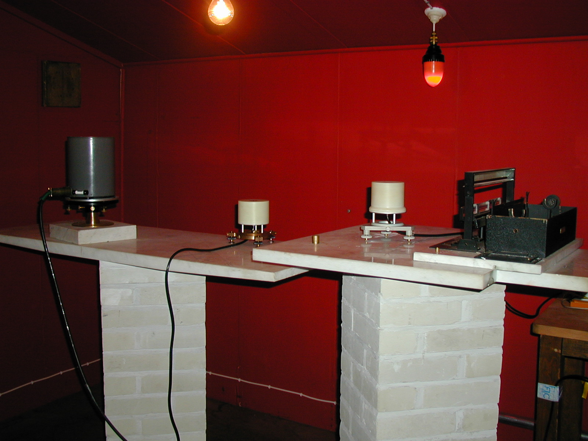

# Інструменти

## Варіометри

З 2021 року основним обсерваторним приладом є варіометр **LEMI-025 №063** розробки і виробництва Львівського центру Інститут космічних досліджень НАН України та ДКА України, встановлений за географічним меридіаном (координати XYZ). Його буде доповнено конструктивно ідентичним варіометром **LEMI-025 №080**, встановленим за магнітним меридіаном (координати HDZ).

Варіометри моделі **LEMI-025** мають:

- часове розділення: **1 с**
- інтервал опитування: **0.1 с**
- дуже високу чутливість
- низький рівень власних шумів
- вбудований годинник з автоматичною синхронізацією з GPS
- запис даних у форматі **IAGA-2002**

**Інформація від розробника:** <https://www.isr.lviv.ua/lemi025.htm>

Варіометри цієї моделі замінили своїх попередників **LEMI-008 №002** та **№016** з часовим розділенням 1 хвилина.

**Інформація від розробника:** <https://www.isr.lviv.ua/lemi008.htm>

## Скалярні магнітометри

Скалярні вимірювання напруженості магнітного поля проводяться компактним обсерваторним магнітометром на ефекті Оверхаузера **GSM-90** розробки і виробництва канадської компанії Gem Systems.

**Характеристики GSM-90:**

- режим неперервного запису
- часове розділення: **1 хвилина**
- частота опитування: кожні **5 секунд**

**Інформація від розробника:** <https://www.gemsys.ca/scalar-magnetometers/>

Він замінив скалярний магнітометр на ефекті Оверхаузера **POS-1** російської розробки.

## Абсолютні вимірювання

Для абсолютних вимірювань використовуються:

- механічний теодоліт **T1** виробництва швейцарської компанії Wild-Heerbrugg (наразі припинила існування)
- одновісний ферозондовий магнітометр **MAG-01H** виробництва британської компанії Bartington
- скалярний магнітометр-градіометр на ефекті Оверхаузера **GSM-19** виробництва канадської компанії Gem Systems

**Інформація від розробника GSM-19:** <https://www.gemsys.ca/rugged-overhauser-magnetometer/>  
**Інформація від розробника MAG-01H:** <https://www.bartington.com/products/mag-01h/>

## Історичні інструменти

### Варіометри

- **магнітограф La Cour**  
  Залишився від британців. Початково було 2 комплекти — грубий і точний, на момент передач залишався 1. Працював з **1957 по 2006 рік**.

- **EDA FM-100B**  
  Залишився від британців, 2 комплекти. Працював з **1974 по 2006 рік**. У 2019 році останній комплект був фізично демонтований.

- **LEMI-008 №02**  
  Координати HDZ, часове розділення 1 хв, частота опитування 1 с. Прийомка з 1998 по 2004 рр., експлуатація з 2004 по 2019 рр. Вийшов з ладу у **травні 2019 р**.

- **LEMI-008 №16**  
  Координати XYZ, часове розділення 1 хв, частота опитування 1 с. Прийомка з 1998 по 2004 рр., експлуатація з 2004 по 2021 рр. В резерві з **17.02.2021**, не працює GPS-синхронізація годинника.

- **LEMI-025 №063**  
  Встановлений за географічним меридіаном (координати XYZ). Часове розділення 1 с, частота опитування 0.1 с. Прийомка з 2019 р., з **17.02.2021 є основним**. Дуже висока чутливість, низький рівень власних шумів, є власна GPS-синхронізація годинника. Спроєктований для спільної роботи зі скалярним магнітометром POS-1. Записує дані у форматі **IAGA-2002**.

- **LEMI-025 №080**  
  Має бути встановлений за магнітним меридіаном (координати HDZ), конструктивно ідентичний попередньому.

> Кімната варіаційних вимірювань до апгрейду 2019 року. Зліва направо: варіометр EDA FM-100B (зараз на цьому місці встановлений LEMI-025 №063), варіометр LEMI-008 №16, варіометр LEMI-008 №02, магнітограф La Cour.

### Магнітні теодоліти

- **THEO-020B** з сенсором Bartington MAG-01H  
  Залишився від британців. Використовувався принаймні до **2022 року**.

- **Wild T1** з сенсором MAG-01H  
  Встановлений у **2022 році**, наразі є основним.

### Скалярні магнітометри

- **Barringer GM-122**  
  Канадський переносний протонний магнітометр на батарейках, що залишився від британців. Призначений переважно для геологічної розвідки. Використовувався імовірно з **1973-74 років по 2005-06 роки** для абсолютних вимірювань.

- **PMP-8**  
  Польський протонний магнітометр. Використовувався з **2005 року** принаймні по **2022 рік** для абсолютних вимірювань.

- **POS-1**  
  Російський магнітометр на ефекті Оверхаузера. В експлуатації з **2011 року**. Мав режим неперервного запису. Мав конструктивний недолік у вигляді внутрішнього годинника з суттєвим дрейфом біля **0,2 с/добу**. За принципом роботи створював паразитні сигнали, що реєструвалися варіометрами, що вимагало складних процедур синхронізації вимірів і фільтрації даних. Принаймні до 2022 року також використовувався для абсолютних вимірювань.

- **GEM GSM-19**  
  Канадський магнітометр-градіометр на ефекті Оверхаузера. В експлуатації принаймні з **2022 року**.

- **GEM GSM-90**  
  Компактний обсерваторний варіант GSM-19, що має режим неперервного запису. В експлуатації принаймні з **2022 року**.
